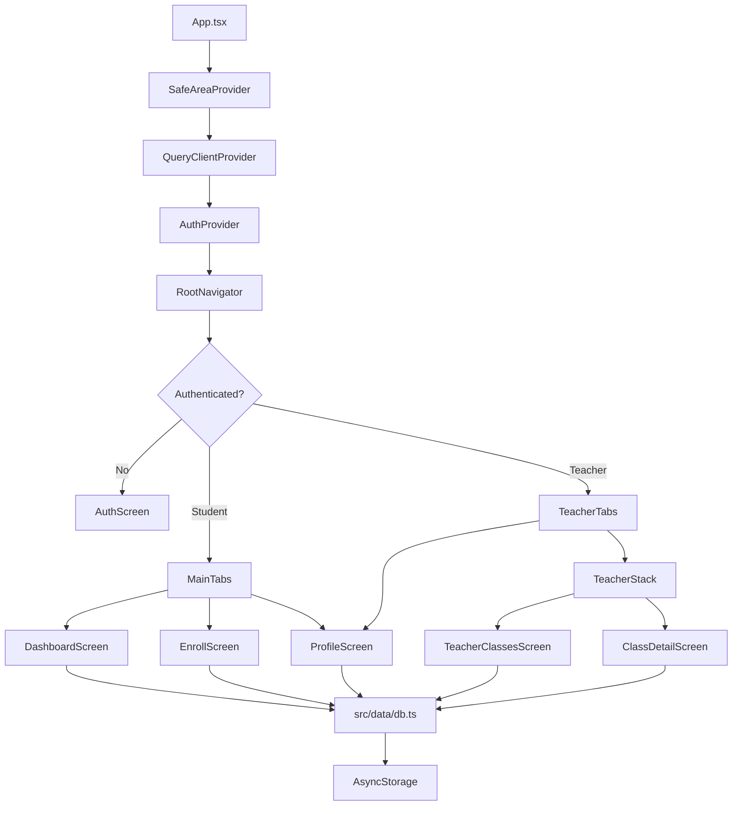

# 🎓 EduInsight AI Mobile

> **Expo-powered classroom companion with a mock backend for students and teachers.**

[](https://expo.dev/)
[](https://reactnative.dev/)
[](https://www.typescriptlang.org/)
[](#-run-the-app)
[](LICENSE)
[](https://github.com/abdalmegedalfiky-ops/Eduinsight-ai-mobile/commits/main)

EduInsight AI Mobile is a two-sided classroom app: **students** join classes with invite codes and track assignments and announcements, while **teachers** create classes, share invite codes, manage rosters, and post assignments or announcements.

The project currently runs with **no external backend required**. All data is served from an in-memory / AsyncStorage mock layer in [`src/data/db.ts`](src/data/db.ts) with realistic latency, so loading states, pull-to-refresh, React Query caching, and mutations behave like they would against a real API.

---

## 📚 Table of Contents

- [Overview](#-overview)
- [Features](#-features)
- [AI Capabilities](#-ai-capabilities)
- [Screenshots](#-screenshots)
- [Architecture](#-architecture)
- [Folder Structure](#-folder-structure)
- [Technology Stack](#-technology-stack)
- [Installation](#-installation)
- [Configuration](#-configuration)
- [Usage](#-usage)
- [Backend Integration Guide](#-backend-integration-guide)
- [Documentation Links](#-documentation-links)
- [Roadmap](#-roadmap)
- [Contributing](#-contributing)
- [License](#-license)

---

## ✨ Overview

EduInsight AI Mobile is designed for quick classroom workflow prototyping:

- Students can create an account, enroll with an invite code, and immediately see relevant assignments and announcements.
- Teachers can create their own classes, generate invite codes, view rosters, post announcements, and add assignments.
- Demo data is seeded locally so the app is useful right after installation.
- Accounts and classroom data persist across app restarts through `AsyncStorage`.
- The mock data API is intentionally shaped like a future production API, making it straightforward to replace with `fetch`, Supabase, Blink, or another backend later.

> **Important:** data is device-local only. It will persist on the same device or simulator, but it will not sync across physical devices until a shared backend is added.

---

## 🚀 Features

### 👩‍🎓 Student Experience

- Sign up or sign in as a student.
- Join classes by invite code.
- View upcoming assignments, including status badges such as `upcoming`, `overdue`, `graded`, and `submitted`.
- Read recent announcements from enrolled classes.
- Pull to refresh assignments and announcements.
- Review enrolled classes from the Profile tab.
- See success feedback after joining a class.

### 👨‍🏫 Teacher Experience

- Sign up or sign in as a teacher.
- Create classes with name, subject, and grade.
- Generate and share invite codes.
- Open each class detail view.
- View student rosters for each class.
- Post announcements to enrolled students.
- Add assignments with relative due dates.
- Review taught classes and invite codes from the Profile tab.

### 🧪 Demo & Mock Backend

- No backend server is required.
- Seeded demo classes, assignments, and announcements live in [`src/data/db.ts`](src/data/db.ts).
- Mock API calls return promises and include artificial latency.
- React Query handles loading states, caching, invalidation, refreshes, and mutation updates.
- Authentication and session state are local demo implementations.

---

## 🤖 AI Capabilities

The current repository is **AI-ready**, but it does not yet call a live AI model or external AI service.

What exists today:

- A structured classroom domain model for users, roles, classes, enrollments, assignments, announcements, and rosters.
- A single data access layer in [`src/data/db.ts`](src/data/db.ts), which is the natural integration point for future AI-backed services.
- Asynchronous API-shaped functions that can be replaced with model-assisted recommendations, classroom insights, or a production backend without rewriting screens.
- Student and teacher workflows that provide the context future AI features would need: assignment timing, class membership, announcements, teacher actions, and student enrollment.

Planned AI opportunities:

- Personalized student assignment insights.
- Teacher-facing class activity summaries.
- Announcement drafting assistance.
- Overdue assignment risk indicators.
- Smart recommendations based on enrolled classes and upcoming work.

---

## 🖼️ Screenshots

Screenshot assets are not checked into the repository yet. Add future screenshots under `docs/screenshots/` using the suggested names below.

| Screen | Placeholder | Suggested Path |
| --- | --- | --- |
| Auth & role selection | Add sign in / sign up screen | `docs/screenshots/auth.png` |
| Student dashboard | Add assignments and announcements view | `docs/screenshots/student-dashboard.png` |
| Join class | Add invite-code enrollment flow | `docs/screenshots/join-class.png` |
| Teacher classes | Add teacher class list and create flow | `docs/screenshots/teacher-classes.png` |
| Class detail | Add roster, assignment, and announcement tools | `docs/screenshots/class-detail.png` |
| Profile | Add role-aware profile and class summary | `docs/screenshots/profile.png` |

---

## 🏗️ Architecture



### Core Flow

1. [`App.tsx`](App.tsx) wires the global providers: safe area, React Query, authentication, status bar, and navigation.
2. [`AuthProvider`](src/context/AuthContext.tsx) restores the local session and exposes `signIn`, `signUp`, and `signOut`.
3. [`RootNavigator`](src/navigation/RootNavigator.tsx) routes users by authentication state and role.
4. Student users land in [`MainTabs`](src/navigation/MainTabs.tsx): Dashboard, Join, and Profile.
5. Teacher users land in [`TeacherTabs`](src/navigation/TeacherTabs.tsx): Classes and Profile.
6. Teacher class navigation is handled by [`TeacherStack`](src/navigation/TeacherStack.tsx): class list to class detail.
7. Screens interact with the mock data API through [`src/data/db.ts`](src/data/db.ts).

---

## 🗂️ Folder Structure

```text
Eduinsight-ai-mobile/
├── App.tsx                         # Providers: SafeArea, React Query, Auth, Navigation
├── app.json                        # Expo app configuration
├── babel.config.js                 # Expo Babel preset
├── connection-test.md              # Repository connection note
├── LICENSE                         # MIT License
├── package.json                    # Scripts and dependencies
├── package-lock.json               # Locked npm dependency graph
├── README.md                       # Project landing page
├── tsconfig.json                   # Expo TypeScript config with strict mode
└── src/
    ├── components/
    │   └── ui.tsx                  # Button, Field, Card, Badge, EmptyState, ScreenHeader
    ├── context/
    │   └── AuthContext.tsx         # Auth state, session restore, sign-in/sign-up/sign-out actions
    ├── data/
    │   └── db.ts                   # Mock database, seeded classes, local persistence, API-shaped functions
    ├── navigation/
    │   ├── MainTabs.tsx            # Student tabs: Dashboard / Join / Profile
    │   ├── RootNavigator.tsx       # Routes by auth state and role
    │   ├── TeacherStack.tsx        # Teacher Classes stack: list -> detail
    │   └── TeacherTabs.tsx         # Teacher tabs: Classes / Profile
    ├── screens/
    │   ├── AuthScreen.tsx          # Sign in, sign up, role selection
    │   ├── DashboardScreen.tsx     # Student assignments and announcements
    │   ├── EnrollScreen.tsx        # Student invite-code enrollment
    │   ├── ProfileScreen.tsx       # Role-aware profile and class summary
    │   └── teacher/
    │       ├── ClassDetailScreen.tsx      # Roster, post announcement, add assignment
    │       └── TeacherClassesScreen.tsx   # Teacher class list and create class flow
    └── theme/
        └── colors.ts               # Design tokens: colors, spacing, radius, typography
```

### Assets

There is no dedicated asset directory yet. The app currently relies on Expo defaults, [`@expo/vector-icons`](https://icons.expo.fyi/), and the configured splash/adaptive icon background colors in [`app.json`](app.json).

---

## 🧰 Technology Stack

| Layer | Technology |
| --- | --- |
| Mobile framework | Expo `~51.0.0` |
| UI runtime | React Native `0.74.0` |
| Language | TypeScript `^5.3.0` |
| React | React `18.2.0` |
| Navigation | React Navigation bottom tabs and native stack |
| Server state | TanStack React Query `^5.40.0` |
| Local persistence | React Native AsyncStorage |
| Icons | Expo Vector Icons / Ionicons |
| Safe areas | `react-native-safe-area-context` |
| Screens | `react-native-screens` |
| Tooling | Expo CLI, Babel preset Expo, strict TypeScript |

---

## ⚙️ Installation

### Prerequisites

- Node.js and npm
- Expo Go on iOS or Android for device testing
- iOS Simulator or Android Emulator for local simulator testing

### Clone and Install

```bash
git clone https://github.com/abdalmegedalfiky-ops/Eduinsight-ai-mobile.git
cd Eduinsight-ai-mobile
npm install
```

---

## 🔧 Configuration

No environment variables are required for the current mock-backed version.

Key configuration:

- Expo app name: `EduInsight AI`
- Expo slug: `eduinsight-ai-mobile`
- Version: `1.0.0`
- Orientation: `portrait`
- Interface style: `dark`
- Splash background: `#0F1117`
- iOS: tablet support enabled
- Android: adaptive icon background set to `#0F1117`
- Web: Metro bundler
- TypeScript: strict mode enabled

Local persistence:

- Users, sessions, enrollments, classes, assignments, and announcements are stored in `AsyncStorage`.
- Demo auth stores passwords in plain text because this is a local mock only.
- Do **not** use this auth implementation against a real backend.

---

## ▶️ Run the App

```bash
npm install
npx expo start
```

Then choose your target:

- Scan the QR code with **Expo Go** on iOS or Android.
- Press `i` for the iOS simulator.
- Press `a` for the Android emulator.
- Press `w` for a web preview.

Available npm scripts:

```bash
npm run start
npm run ios
npm run android
npm run web
```

---

## 🧭 Usage

### Try It as a Student

1. Sign up and choose **Student**.
2. You will land on an empty Dashboard. No classes yet is expected.
3. Go to the **Join** tab and enter an invite code.
4. You will see a success modal.
5. Dashboard and Profile will populate with that class's assignments and announcements.

Demo invite codes:

| Invite Code | Class | Subject | Grade | Teacher |
| --- | --- | --- | --- | --- |
| `ALG2-7F3K` | Algebra II | Mathematics | 10th Grade | Ms. Hana Reyes |
| `BIO1-4X8Q` | Cell Biology | Science | 10th Grade | Dr. Amina Saleh |
| `HIST-9P2M` | World History | History | 10th Grade | Mr. Daniel Osei |
| `ENGL-2T6R` | English Literature | English | 10th Grade | Ms. Clare Whitfield |
| `PHYS-5W1N` | Physics Fundamentals | Science | 11th Grade | Mr. Karim Idris |
| `ARAB-8J4D` | Arabic Language | Languages | 10th Grade | Ms. Lina Haddad |
| `COMP-3Z9L` | Computer Science I | Technology | 11th Grade | Mr. Youssef Tarek |
| `ARTS-6Y5B` | Visual Arts | Arts | 10th Grade | Ms. Priya Nair |

### Try It as a Teacher

1. Sign up and choose **Teacher**.
2. Go to the **Classes** tab.
3. Tap **Create a class** and enter a class name, subject, and grade.
4. The app will generate an invite code.
5. Share the invite code with students, or use a student account in another session to join with it.
6. Tap into the class to view the roster, post an announcement, or add an assignment.
7. Announcements and assignments show up immediately for any student enrolled in that class.

---

## 🔌 Backend Integration Guide

Everything funnels through [`src/data/db.ts`](src/data/db.ts).

Each exported function already has the shape expected from a real API:

- `signIn`
- `signUp`
- `signOut`
- `getSessionUser`
- `getAllClasses`
- `getClassesForStudent`
- `getClassesForTeacher`
- `getEnrolledClassIds`
- `enrollWithInviteCode`
- `createClass`
- `getRosterForClass`
- `getAssignmentsForStudent`
- `getAnnouncementsForStudent`
- `getAssignmentsForClass`
- `getAnnouncementsForClass`
- `postAnnouncement`
- `createAssignment`

To swap in a real backend later, replace the body of each function with a `fetch`, Supabase, Blink, or other API call. The screens and React Query hooks can stay the same because they already consume promises and invalidate query keys after mutations.

---

## 🎨 Design Direction

EduInsight AI uses a dark **"study at night"** visual direction.

- Deep indigo `#4F46E5` is structural: header text, auth logo mark, active class indicators, and primary actions.
- Teal `#14B8A6` is reserved for live or in-progress signals: active tabs, due dates, success states, invite codes, and accents.
- Near-black `#0F1117` anchors the app background.
- Cards, inputs, borders, spacing, radii, and typography tokens live in [`src/theme/colors.ts`](src/theme/colors.ts).

---

## ✅ Quality Notes

- `npx tsc --noEmit` passes clean.
- Demo-only authentication stores passwords in plain text in AsyncStorage.
- This is acceptable for a local mock, but it must be replaced before production use.

---

## 🔗 Documentation Links

- [App entry point](App.tsx)
- [Mock database and API surface](src/data/db.ts)
- [Authentication context](src/context/AuthContext.tsx)
- [Root navigation](src/navigation/RootNavigator.tsx)
- [Student tabs](src/navigation/MainTabs.tsx)
- [Teacher tabs](src/navigation/TeacherTabs.tsx)
- [Teacher stack](src/navigation/TeacherStack.tsx)
- [Design tokens](src/theme/colors.ts)
- [Connection test note](connection-test.md)
- [License](LICENSE)

---

## 🛣️ Roadmap

### Completed

- [x] Expo + React Native app shell
- [x] TypeScript configuration with strict mode
- [x] Student and teacher role selection
- [x] Local sign up, sign in, sign out, and session restore
- [x] Student dashboard with assignments and announcements
- [x] Invite-code class enrollment
- [x] Teacher class creation
- [x] Teacher roster, announcement, and assignment flows
- [x] AsyncStorage-backed mock data layer
- [x] React Query data fetching and mutation invalidation
- [x] Dark academic design system

### Next

- [ ] Add checked-in screenshots under `docs/screenshots/`.
- [ ] Replace demo auth with secure backend authentication.
- [ ] Connect a shared backend for cross-device sync.
- [ ] Add production-ready role and permission checks.
- [ ] Add AI-powered student insights and teacher summaries.
- [ ] Add push notifications for due dates and announcements.
- [ ] Add automated tests for data flows and screen behavior.
- [ ] Add CI for type-checking and quality checks.
- [ ] Add deployment/build documentation for app stores and web.

---

## 🤝 Contributing

Contributions are welcome.

1. Fork the repository.
2. Create a feature branch.
3. Install dependencies with `npm install`.
4. Make focused changes.
5. Run `npx tsc --noEmit`.
6. Open a pull request with a clear summary and screenshots for UI changes.

Please keep the current architecture in mind: screens should continue to call the data layer through [`src/data/db.ts`](src/data/db.ts) or a future compatible backend client, so the app remains easy to evolve.

---

## 📄 License

This project is licensed under the [MIT License](LICENSE).

Copyright (c) 2026 Abdalmegeed Alfiky.
